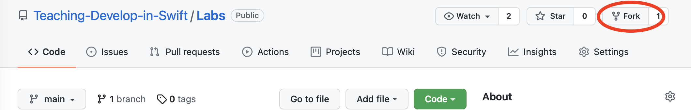
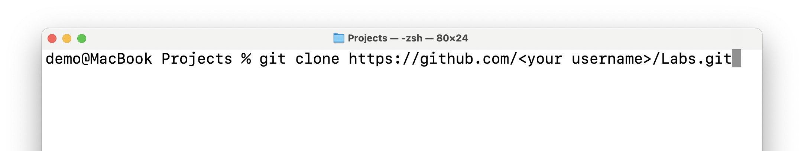
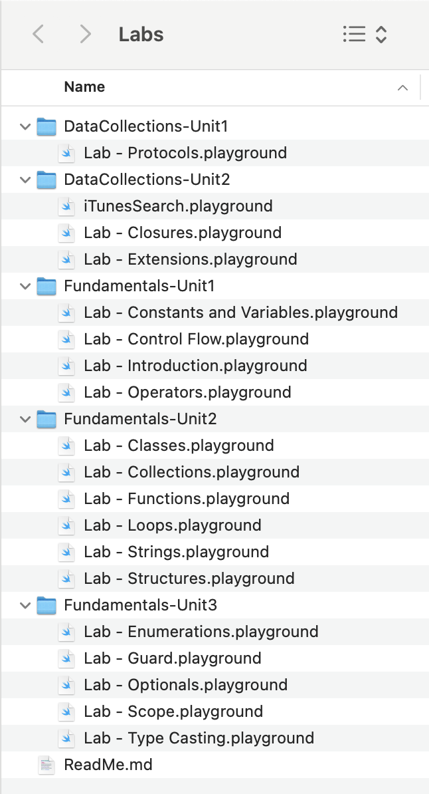
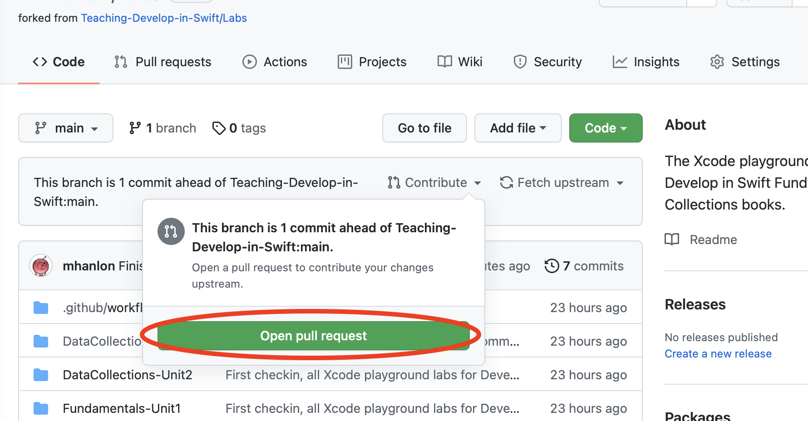

# Develop in Swift Labs
A repository with the student materials from the Xcode 12 version of Develop with Swift Fundamentals

This repo contains the Swift Playground labs from Apple's [Develop with Swift Fundamentals](https://apple.co/developinswiftfundamentals) curriculum.

You can download these resources and the project files for the other chapters from Apple here: [https://education-static.apple.com/fundamentals/xcode12/student.zip](https://education-static.apple.com/fundamentals/xcode12/student.zip)

This repo is intended as an aide to the online Develop with Swift Fundamental courses you'll be attending, as a way of helping you go through the material before our final catch-up.

## HOWTO: Use this Repository

If you are taking the Develop with Swift Fundamentals course, you should fork this repo by tapping on the Fork button above.

Then, in Terminal.app on your Mac, `cd` into the directory in which you keep your projects, then run `git clone https://github.com/<your username>/Labs.git`

The repo contains all the labs with Swift Playground exercises from the Develop  with Swift Fundamentals curriculum, [available from Books as a free download](https://apple.co/developinswiftfundamentals).

## HOWTO:  Take the Course

Read through the lessons and follow along wherever possible. At the end of each lesson there is a lab. Complete the associated Swift Playground.

When you've completed all the labs, in Terminal, change directories into the Labs folder. If you are using the same Terminal window you cloned the repository in, you can likely type `cd Labs` to do so.
Then type `git add .`, to add all your changed files, then `git commit -m "A little message about the files you changed"` to save the changes. The message can be anything; it's usually most helpfull to leave a comment about what the changes were for, or maybe any questions you might have had about the assignment or the code you wrote (or failed to write).
Lastly, type `git push origin` and your code will be pushed back up to Github.

On the page for your fork of the repo `(https://github.com/<your_username>/Labs)` you'll push the button to create a new pull request (you may need to refresh the page):

Make sure the base repository is `Teaching-Develop-in-Swift/Labs` and the base is `main`, like so (roughly):

Create the pull request, and I'll be able to review your changes to the playgrounds and we can discuss your code in the final catch-up.

### Other links
You may also want to take a look at the [AppDevResources repository](https://github.com/mhanlon/AppDevResources). This has some useful pointers that others taking the App Development with Swift class have found useful.

Happy coding!

